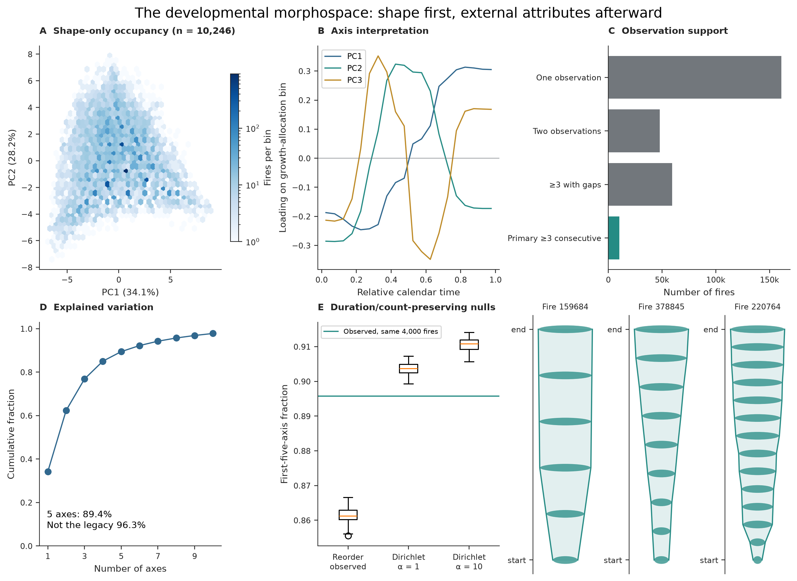

# Fires follow different developmental pathways

Finding 01 · Developmental morphology

The primary morphospace reveals broad, reproducible gradients in when observed growth is allocated—not a catalog of discrete fire types.

Question

Can observed wildfire histories be compared on common developmental
coordinates without defining those coordinates by final size, duration, or
weather?

Answer

Yes. A 20-bin shape-only representation places **10,246 consecutively observed
fires** in a shared space. Its leading gradients contrast earlier with later
allocation and concentrated with more distributed growth. Five axes summarize
**89.4%** of standardized variance.

<section class="fire-figure" markdown>

<strong>What to notice.</strong> The occupied space is broad and continuous.
PC1 (**34.1%**) separates earlier from later allocation; PC2 (**28.2%**)
contrasts middle-concentrated with more endpoint-weighted allocation. The
example VASEs are landmarks along gradients, not named natural classes. The
lower-left census shows why the strict cohort must not be presented as all
fires. [Technical caption](../reproduce-figures.md#figure-2-the-developmental-morphospace)

</section>

How to read this figure

- **Panels:** A is the shape space; B shows which relative-time bins define
  its first two axes; C audits observation support; D shows real example VASEs.
- **Axes:** Moving along PC1 shifts allocation from earlier toward later
  development. PC2 contrasts middle-concentrated with more endpoint-weighted
  histories.
- **Look here:** The points occupy a continuum rather than separate islands.
  Use the loadings and example VASEs together to interpret that continuum.
- **Supported conclusion:** The broad gradients describe reproducible
  developmental variation. They are not established natural fire classes.

<strong>Challenge this result.</strong>
If the gradients vanished under stricter observation requirements or another
valid compositional geometry, they could be artifacts of short records or an
analysis choice. [See what those tests found →](../validation/index.md#does-the-result-depend-on-observation-depth)

Evidence trail

<b>Claim</b>Broad developmental gradients, not discrete types

<b>Figure</b>Figure 2 · primary N = 10,246

<b>Analysis</b><code>analysis/v2/</code> PCA scores, loadings, variance, and sensitivity tables

<b>Reproduce</b><a href="https://github.com/CU-ESIIL/fire_vase/blob/main/manuscript_figures/02_figure_2.py">Figure script</a> · <a href="../reproduce/notebooks/">notebooks</a>

<b>Validate</b><a href="../validation/#could-the-geometry-be-an-artifact">Depth and geometry challenges</a>

<b>Paper</b><a href="../manuscripts/fire_vase_developmental_morphology/manuscript_v2/#a-shared-coordinate-system-without-a-universal-restricted-wedge-claim">Current claim</a>

## What we measured

Each consecutive history was transformed into 20 nonnegative relative-time
allocation bins summing to one. The PCA used those bins only. Final area,
duration, observation count, absolute peak, mean growth, slenderness, and
weather were projected later rather than used to define the axes.

<strong>10,246</strong>primary consecutive histories

<strong>34.1%</strong>variance on PC1

<strong>89.4%</strong>variance on the first five axes

## How well does it hold up?

- At **≥7 consecutive observations**, 1,171 fires remain. Distance ranks on
  shared anchors correlate **0.969** with the primary space, although 15-neighbor
  overlap falls to **71.8%** and five-axis coverage to **74.2%**.
- Five-dimensional bootstrap subspace overlap has median **0.999** with a
  2.5–97.5% range of **0.998–1.000**.
- Hellinger compositional geometry preserves the broad structure but changes
  some local neighborhoods and extreme exemplars.
- Null allocations also compress, so low dimensionality alone is not evidence
  of a uniquely biological constraint.

## What this does not show

This analysis does not establish natural fire classes, independence from
endpoint attributes, transfer to long or intermittently observed fires, or a
universal restricted wedge. PC1 remains moderately associated with final area,
duration/count, and observed daily peak even though those quantities were
excluded from fitting.

??? info "Technical details"

    See [growth and shape coordinates](../manuscripts/fire_vase_developmental_morphology/manuscript_v2.md#growth-and-shape-coordinates),
    [second-pass validation](../manuscripts/fire_vase_developmental_morphology/manuscript_v2.md#second-pass-validation),
    and the [complete figure gallery](../reproduce-figures.md).

<nav class="fire-next">
<a href="../"><small>Back</small><strong>All findings</strong></a>
<a href="../temporal-ordering/"><small>Next question</small><strong>Does order matter? →</strong></a>
</nav>
