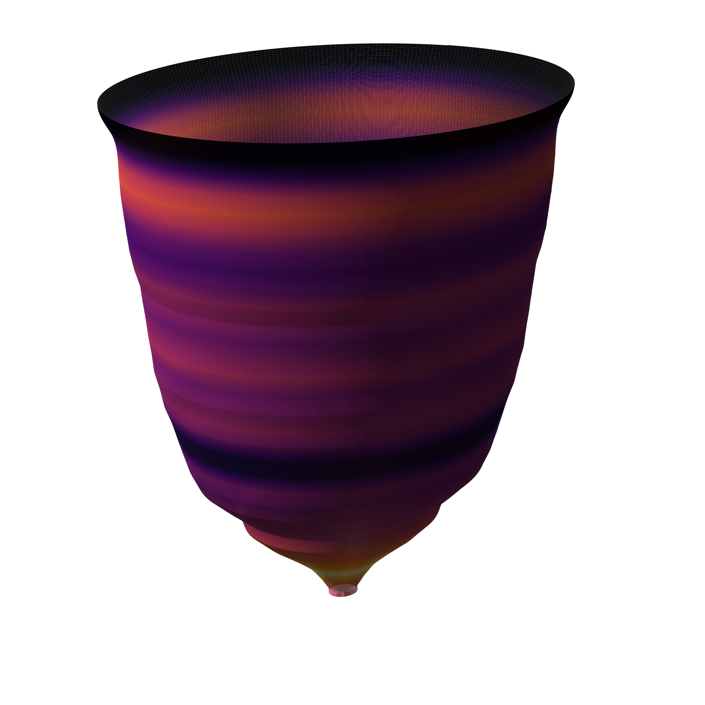

<section class="fire-home-hero">

Supplementary information for reproducible wildfire science

<h1>Fire VASE</h1>

<h2>Developmental morphology first. Weather as an external layer.</h2>

Fire VASE turns daily fire histories into comparable shapes, then links those
forms to meteorological exposure through an open data lake and numbered figure pipeline.

<a class="md-button md-button--primary fire-button" href="reanalysis-v2/">Corrected V2 Analysis</a>
<a class="md-button fire-button" href="https://github.com/CU-ESIIL/fire_vase/blob/main/notebooks/reproduce_fire_vase_pipeline.ipynb">Open the Notebook</a>

</section>

<section class="fire-home-strip" markdown>

278,569
FIRED events represented as developmental histories

10,246
consecutive multi-observation histories in the primary v2 morphospace

1
shareable data lake for reproducing the manuscript workflow

</section>

<section class="fire-home-intro" markdown>

Where to start

## Recreate the dataset, analysis, and figures

This site is the manuscript-support hub for collaborators, reviewers, and
readers who want to inspect the data boundary or rerun the analysis. Start from
the shared CyVerse data lake for fast reproduction, or rebuild from source
caches when auditing the complete pipeline.
</section>

<section class="fire-home-pathways">

<a class="fire-pathway fire-pathway--data" href="reproduce-data-lake/">
Data Lake
<h2>Get the research package</h2>

Download, verify, or rebuild the FIRED/gridMET caches, Parquet tables,
developmental morphology products, schemas, and manuscript artifacts.

</a>

<a class="fire-pathway fire-pathway--pipeline" href="vignette-reproduce-pipeline/">
Pipeline
<h2>Run the full workflow</h2>

Move from repository setup through data-lake verification, analysis
regeneration, figure rendering, and final reproducibility checks.

</a>

<a class="fire-pathway fire-pathway--figures" href="reproduce-figures/">
Figures
<h2>Rebuild the manuscript visuals</h2>

Use the numbered scripts in <code>manuscript_figures/</code> to reproduce every main figure
and the validation supplement.

</a>

<a class="fire-pathway fire-pathway--methods" href="methods/">
Methods
<h2>Follow the scientific chain</h2>

Trace source fire records through VASE construction, climate attribution,
developmental morphology, validation, and interpretation.

</a>

</section>

<section class="fire-home-links" markdown>

Core resources

## Handoff links

- Data lake:
  [CyVerse Fire_Vase folder](https://de.cyverse.org/data/ds/iplant/home/shared/esiil/Fire_Vase?type=folder&resourceId=ce3e72e4-95d1-11f1-852a-90e2ba675364)
- Source code:
  [CU-ESIIL/fire_vase](https://github.com/CU-ESIIL/fire_vase)
- Runnable notebook:
  [reproduce_fire_vase_pipeline.ipynb](https://github.com/CU-ESIIL/fire_vase/blob/main/notebooks/reproduce_fire_vase_pipeline.ipynb)
- Script summaries:
  [Code Map](code-map.md)
- Reusable VASE implementation:
  [CU-ESIIL/cubedynamics](https://github.com/CU-ESIIL/cubedynamics)

Manuscript

## Current text

The current manuscript draft and transparency materials are included so the
analysis, figures, and scientific claims can be read together.

[Current v2 manuscript](manuscripts/fire_vase_developmental_morphology/manuscript_v2.md){ .md-button .fire-button }
[AI transparency](manuscripts/fire_vase_developmental_morphology/ai_transparency_statement.md){ .md-button .fire-button }
[Expanded AI report](manuscripts/fire_vase_developmental_morphology/ai_transparency_report.md){ .md-button .fire-button }

</section>
