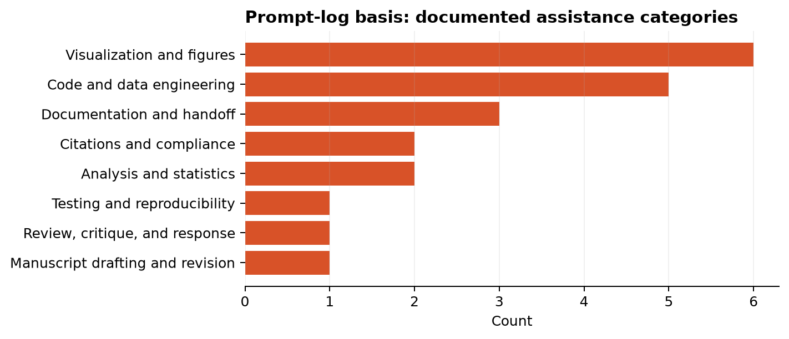
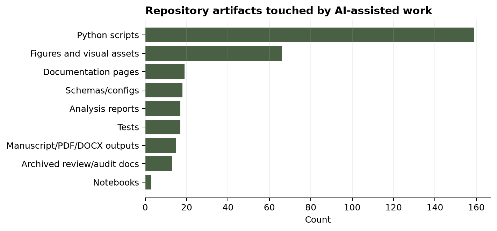
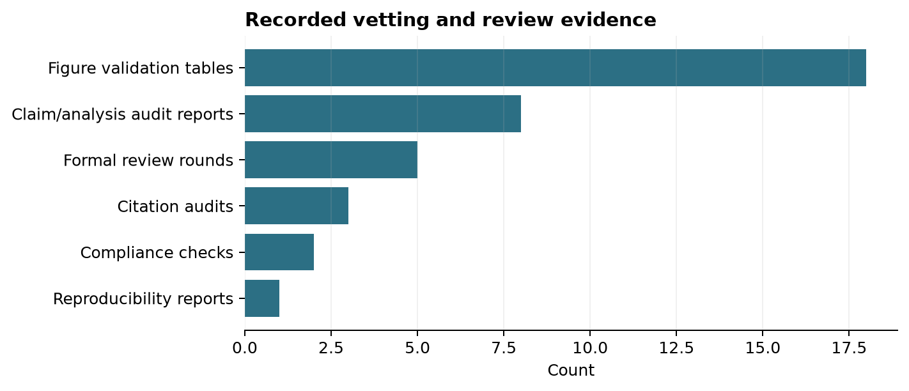
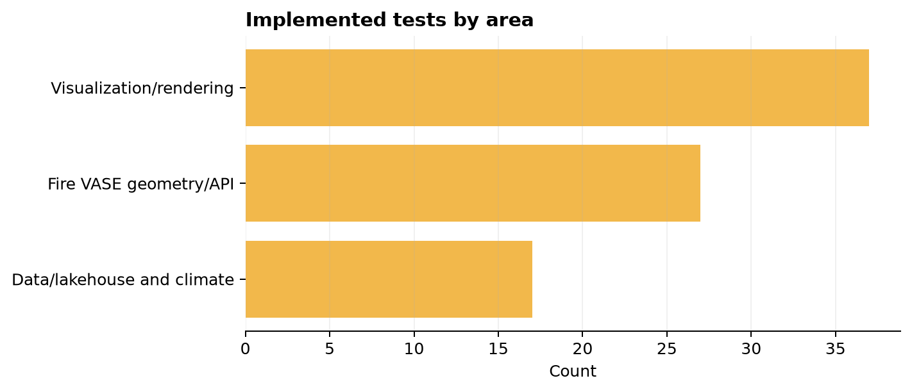

# Expanded AI Transparency Report

Date generated: 2026-08-12

This document expands the short manuscript AI transparency statement into a
repository-auditable report. It is generated by
[`scripts/generate_ai_transparency_report.py`](https://github.com/CU-ESIIL/fire_vase/blob/main/scripts/generate_ai_transparency_report.py)
from the project record: the existing prompt-log-basis statement, archived
formal reviews, citation/compliance audits, analysis reports, tests, schemas,
figure outputs, notebooks, and reproducibility metadata.

## Scope And Limitation

The repository currently preserves a prompt-log-derived project record, but it
does not include a raw, line-by-line private chat transcript as a standalone
file. The statistics below therefore quantify **documented AI-assisted work
preserved in the repository**, not every private prompt ever typed during the
project. If a raw prompt log is added later, rerun the generator and extend its
source list so these counts can become transcript-level rather than
artifact-level.

## Manuscript-Ready Statement

OpenAI Codex/ChatGPT was used as an AI-assisted coding, analysis,
visualization, documentation, and editorial tool during development of Fire
VASE. AI assistance included data-lake and lakehouse scripting, climate
attribution workflows, morphospace and validation analyses, figure rendering,
website and notebook documentation, manuscript drafting and revision, simulated
review, citation auditing, and reproducibility checks. The AI system did not
originate the underlying FIRED, MODIS burned-area, gridMET, PRISM, or other
observational data; did not make final scientific judgments independently; and
is not listed as an author. Human investigators directed the analyses, selected
the scientific claims, reviewed code and outputs, verified calculations and
citations where reported, and remain responsible for the integrity,
interpretation, and final manuscript.

## What AI Was Used To Do

The current prompt-log basis contains **9 documented assistance
items**. Items can map to more than one category, because a single prompt may
combine, for example, figure generation, testing, and manuscript revision.



| category | count |
| --- | --- |
| Visualization and figures | 6 |
| Code and data engineering | 5 |
| Documentation and handoff | 3 |
| Analysis and statistics | 2 |
| Citations and compliance | 2 |
| Manuscript drafting and revision | 1 |
| Review, critique, and response | 1 |
| Testing and reproducibility | 1 |

## What The Work Produced

AI-assisted work is visible in repository artifacts rather than only in prose.
The inventory below counts current tracked project products by broad type. Some
artifacts were created directly with AI assistance; others were generated or
organized through AI-assisted scripts and documentation workflows.



| artifact_group | count |
| --- | --- |
| Python scripts | 159 |
| Figures and visual assets | 66 |
| Documentation pages | 19 |
| Schemas/configs | 18 |
| Tests | 17 |
| Analysis reports | 17 |
| Manuscript/PDF/DOCX outputs | 15 |
| Archived review/audit docs | 13 |
| Notebooks | 3 |

## How AI Use Was Vetted

The project record includes review, audit, reproducibility, and validation
artifacts that constrain what AI-generated or AI-assisted work could be used
for. These records include formal simulated review rounds, citation audits,
author-guideline checks, claim audits, reproducibility reports, and figure
validation tables.



| vetting_record | count |
| --- | --- |
| Figure validation tables | 18 |
| Claim/analysis audit reports | 8 |
| Formal review rounds | 5 |
| Citation audits | 3 |
| Compliance checks | 2 |
| Reproducibility reports | 1 |

Latest recorded checks: data lake `pass`, derived statistics `pass`, figure pixels `fail`.

## Tests Implemented

The repository currently contains **81
test functions** across **17 test files**. The tests emphasize the
Fire VASE geometry/API surface, rendering behavior, lakehouse/cache contracts,
and real-data smoke checks.



| area | test_count |
| --- | --- |
| Visualization/rendering | 37 |
| Fire VASE geometry/API | 27 |
| Data/lakehouse and climate | 17 |

## Evidence Categories In Repository Text

The generator classified **54 Markdown/TXT evidence files** by
dominant keyword category. This is a coarse but reproducible proxy for where the
AI-assisted record is concentrated.

| category | files | words |
| --- | --- | --- |
| Code and data engineering | 17 | 12157 |
| Visualization and figures | 16 | 15449 |
| Analysis and statistics | 12 | 9247 |
| Citations and compliance | 4 | 2322 |
| Manuscript drafting and revision | 3 | 2464 |
| Documentation and handoff | 2 | 156 |

## Prompt-Log Basis Items

The existing AI transparency statement preserved the following documented
prompt-log basis items:

- Real-data Fire VASE panel generation, including static PDF panels for non-prescribed fires and climate-colored panels for maximum temperature, minimum temperature, vapor pressure deficit, and wind.
- Debugging and correcting climate-color mapping so daily or hourly climate values were represented as developmental rings rather than misleading triangle-wise color variation.
- Building exploratory reports and atlases from real FIRED/gridMET data, including death/ending diagnostics, developmental atlases, size-stratified samples, population summaries, morphology atlases, and climate-vs-shape comparisons.
- Developing Fire VASE data infrastructure, including lakehouse-style tables, schemas, durable climate fields on vase slices, full multi-year gridMET caches, processing manifests, validation reports, and perimeter/extension climate-exposure pilots.
- Writing and revising analysis scripts for morphospace construction, feature extraction, PCA, medoids, null-model audits, climate coupling summaries, leakage-safe prediction baselines, and state-dependent climate analyses.
- Producing figures, figure legends, data dictionaries, manifests, and PDF manuscripts; rendering PDFs to images for visual quality checks; and revising figures to improve readability and remove overlapping labels.
- Drafting manuscript narratives, Science-style manuscript formats, author-guideline compliance notes, response-to-review material, and multiple rounds of simulated editor/reviewer critique followed by manuscript edits.
- Searching for, organizing, and auditing citations, including checking that cited references were real and that claims matched the cited literature where reported.
- Writing repository documentation, tests, examples, and development notes for CubeDynamics and Fire VASE workflows.

## Responsibility Boundary

AI assistance was used to accelerate implementation, synthesis, drafting,
review, and quality control. It was not used as an autonomous author, data
source, or final scientific authority. Human investigators remain responsible
for study design, data selection, analytic choices, interpretation, citation
accuracy, and all claims in the final manuscript.

## Refresh Instructions

Regenerate this report after major prompt-log, manuscript, analysis, figure, or
testing updates:

```bash
uv run python scripts/generate_ai_transparency_report.py
```

Machine-readable outputs:

- Summary JSON: `docs/assets/ai_transparency/ai_transparency_summary.json`
- Prompt category table: `docs/assets/ai_transparency/prompt_type_breakdown.csv`
- Evidence classification table: `docs/assets/ai_transparency/evidence_file_classification.csv`
- Artifact inventory: `docs/assets/ai_transparency/artifact_inventory.csv`
- Vetting records: `docs/assets/ai_transparency/vetting_records.csv`
- Test inventory: `docs/assets/ai_transparency/tests_by_area.csv`
