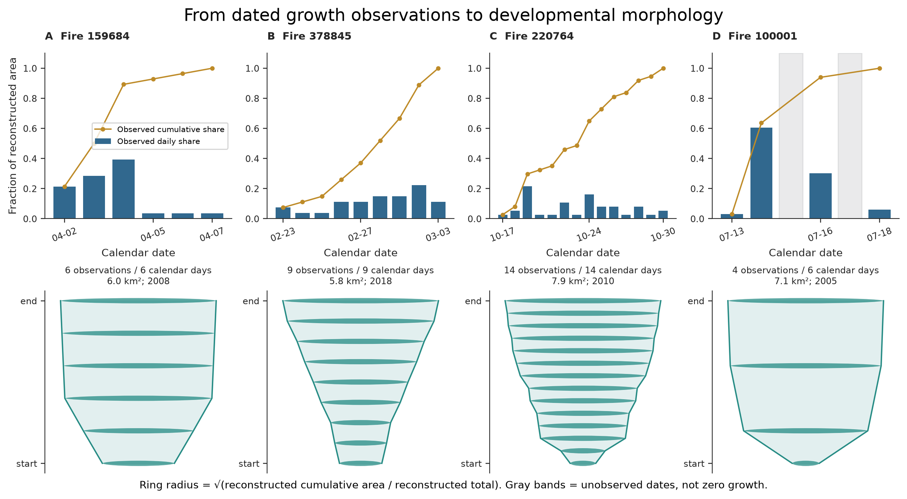
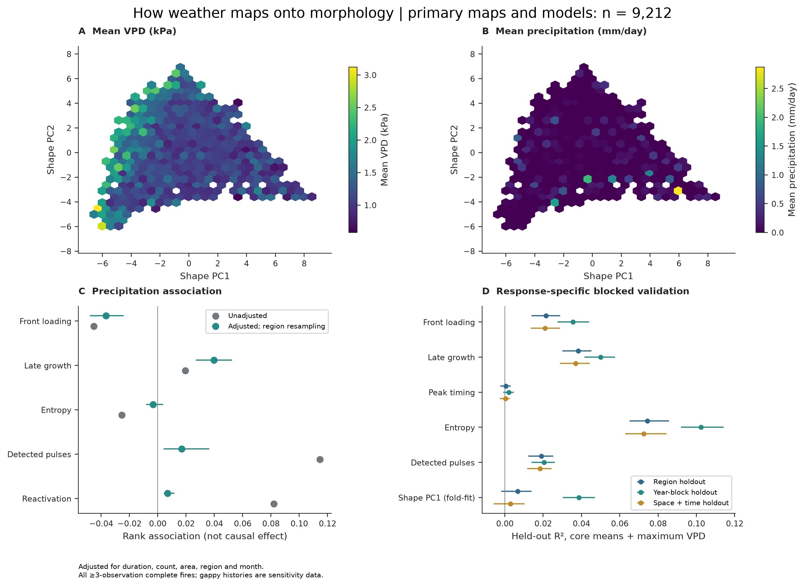
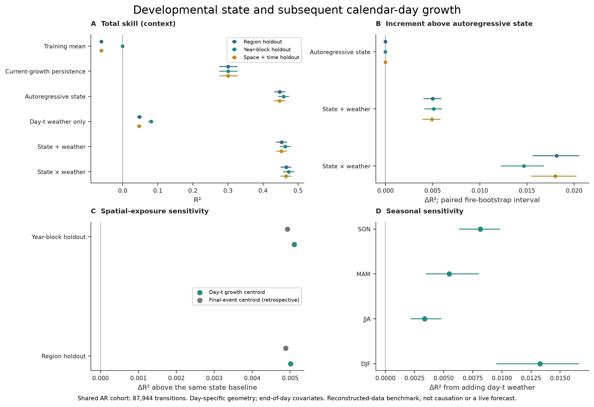
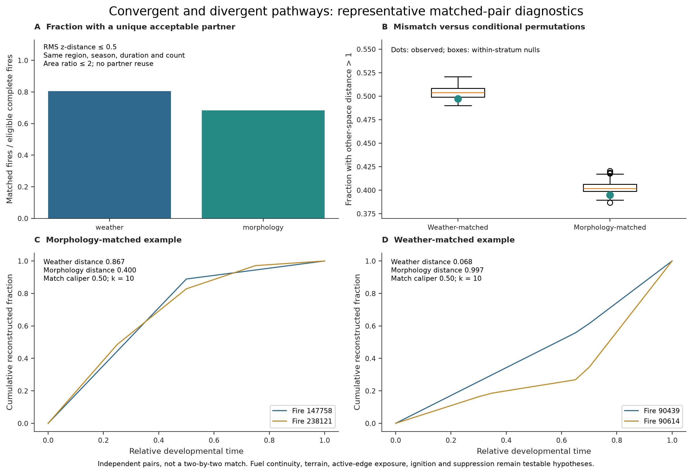

# Second-generation analysis

Fire VASE represents developmental morphology before weather is considered.
Weather is an external demonstration, not a definition or causal explanation
of the structure. The [v2 manuscript](manuscripts/fire_vase_developmental_morphology/manuscript_v2.md)
supersedes the climate-centered v1 generation.

## What changed

- True observed daily peak replaces catalog area divided by duration. Entropy
  uses normalized reconstructed growth; it is undefined for incomplete or
  zero-total histories. Current catalog and reconstructed totals happen to agree.
- The primary morphospace uses only normalized growth-allocation bins for
  10,246 fires with at least three consecutive observations. Area, duration,
  observation count and weather are external attributes. PC1 explains 34.1%;
  five axes explain 89.4%. Neither compression nor a wedge proves biological
  constraint: duration/count-preserving nulls also compress strongly.
- Nested event-weather models share 9,212 complete primary fires and use
  region, year-block and strict crossed spatiotemporal holdouts. The old 0.349
  cross-response median is withdrawn; each response is reported separately.
- Only exact calendar-day transitions are used for subsequent growth. Weather
  is sampled at day-t newly burned-area centroids, not final-event centroids.
  The shared autoregressive cohort has 87,944 transitions from 31,700 fires.
  Additive weather gives a small regional increment (~0.005 R²); interactions
  give ~0.018 above state. These are reconstructed-data associations/predictions,
  not proof of causation or information availability in an operational system.
- Matching uses unique partners, declared calipers and nuisance strata.
  Representative median-mismatch examples replace adversarial maxima.
  Observed mismatch rates are compatible with conditional permutation ranges;
  mechanistic interpretations remain hypothesis-generating.

## Reproduce

Use the existing real data lake; absent required inputs raise an error. No new
external data download or synthetic fallback is part of this workflow.

```sh
PYTHONPATH=src:scripts OPENBLAS_NUM_THREADS=1 MPLCONFIGDIR=/tmp/fire-vase-v2-mpl .venv/bin/python manuscript_figures/00_run_all.py --generation v2 --data-lake data_lake/fire-vase-data-lake-v0.1
.venv/bin/python -m pytest tests/test_analysis_v2.py -q
```

The configuration is `config/analysis_v2.json`, seed 20260828. Use
`--render-only` with the figure command after successful statistics generation.
The v1 comparison is deliberately separate:

```sh
PYTHONPATH=scripts/figures:scripts:src .venv/bin/python scripts/reproduce_v1_comparison.py
```

## Outputs and provenance

| Output | Repository location |
| --- | --- |
| Audit and old/new conclusions | `analysis/v2/audit_report.md`, `issue_audit.csv` |
| Per-event growth/entropy/date audit | `analysis/v2/event_semantic_audit.csv.gz` |
| PCA, nulls, stability and every model comparison | `analysis/v2/*.csv` |
| Source and exposure provenance | `input_audit.json`, `input_hashes.json`, `day_t_weather_manifest.json` in `analysis/v2/` |
| Code/configuration/output hashes | `analysis/v2/run_manifest.json`, `publication_manifest.json` |
| Five main figures and supplement, PDF/PNG/SVG | `figures/v2/` |
| Current manuscript source and PDF | `docs/manuscripts/fire_vase_developmental_morphology/manuscript_v2.md`, `output/pdf/fire_vase_v2_manuscript.pdf` |
| Preserved references and reproduced v1 outputs | `archive/comparison_v1/` |

Large regenerable Parquet tables remain local and ignored by Git. The source
package retains its FIRED/gridMET citation and reuse terms. No data are
relicensed by this analysis. The full manuscript describes the strict cohort's
selection limits, conditional rather than refitted-model uncertainty, the small
number of region clusters, satellite/date uncertainty and matching assumptions.

## Figures









