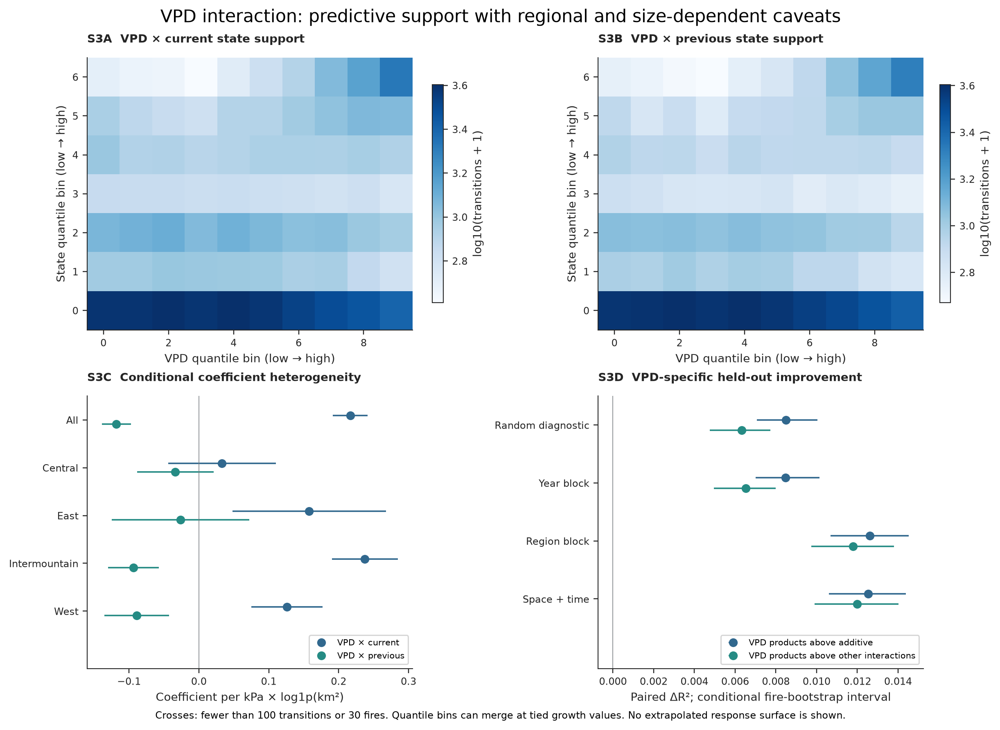
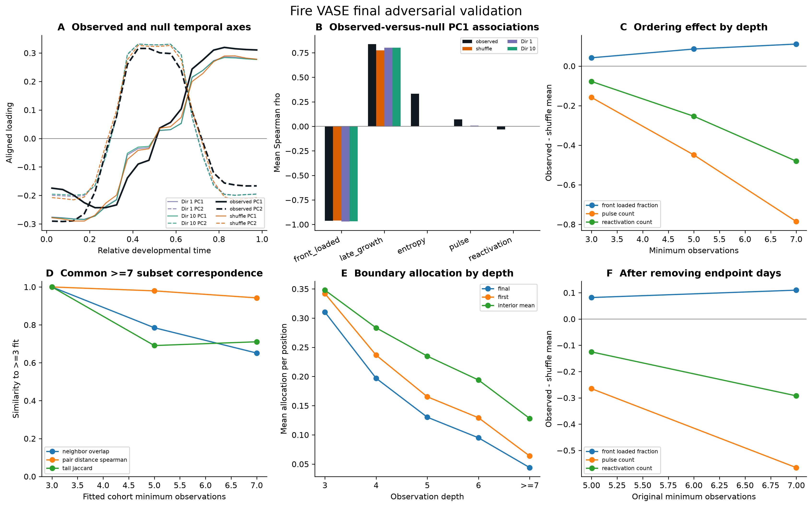

# Second-generation analysis

Fire VASE changes the response being explained: ordered wildfire development,
not only final area, duration, or peak growth. The
[manuscript narrative](manuscript.md) develops that project-level argument. This
page documents the corrected empirical implementation: developmental morphology
is constructed before weather is considered, and weather remains an external,
non-causal explanatory layer. The
[v2 technical manuscript](manuscripts/fire_vase_developmental_morphology/manuscript_v2.md)
supersedes the climate-centered v1 generation for quantitative claims.

The second-pass validation freezes a bounded scientific story: broad shape
gradients and nonrandom temporal ordering are supported, but event-weather
predictability is weak and heterogeneous. The supplied `main-22.pdf` and
`supplementary-3.pdf` define the current narrative; the assembled submission
PDFs and `analysis/submission_freeze/` control the figures, claim sources, and
release-readiness checks.

## What changed

- True observed daily peak replaces catalog area divided by duration. Entropy
  uses normalized reconstructed growth; it is undefined for incomplete or
  zero-total histories. Current catalog and reconstructed totals happen to agree.
- The primary morphospace uses only normalized growth-allocation bins for
  10,246 fires with at least three consecutive observations. Area, duration,
  observation count and weather are external attributes. PC1 explains 34.1%;
  five axes explain 89.4%. Neither compression nor a wedge proves biological
  constraint: duration/count-preserving nulls also compress strongly.
- Nested event-weather models share 9,212 complete primary fires and use
  region, year-block and strict crossed spatiotemporal holdouts. The old 0.349
  cross-response median is withdrawn; each response is reported separately.
- Only exact calendar-day transitions are used for subsequent growth. Weather
  is sampled at day-t newly burned-area centroids, not final-event centroids.
  The shared autoregressive cohort has 87,944 transitions from 31,700 fires.
  Additive weather gives a small regional increment (~0.005 R²); interactions
  give ~0.018 above state. These are reconstructed-data associations/predictions,
  not proof of causation or information availability in an operational system.
- Matching uses unique partners, declared calipers and nuisance strata.
  Representative median-mismatch examples replace adversarial maxima.
  Observed mismatch rates are compatible with conditional permutation ranges;
  mechanistic interpretations remain hypothesis-generating.

## What survived scientific validation

At least seven consecutive observations leaves 1,171 fires. Relative to the
primary fit, five-axis distance ranks on shared anchors correlate 0.969, but
15-neighbor overlap is 71.8% and five-axis coverage falls to 74.2%. Broad
gradients are more stable than exact local neighbors or extreme exemplars.

In a recorded 4,000-fire sample, first-half growth allocation averages 0.541
versus 0.500 after shuffling the same increments, and detected pulses average
1.249 versus 1.413. This supports nonrandom observed ordering, not a uniquely
biological low-dimensional wedge. Excluded endpoint attributes remain moderately
associated with shape. No formal test establishes the absence of latent classes.

Adding year to duration/count/area/region/month controls leaves small weather
associations: mean VPD versus late allocation has partial rank correlation
-0.069; precipitation versus pulses is only 0.025, with a regional interval
including zero. The weather-complete population is CONUS-only in these inputs.

VPD-by-current/prior growth products add about 0.006-0.012 R² above the other
weather interactions across holdouts. This is supported with caveats: coefficients
vary by region, fire size and partial edge years; all exposures are reconstructed
end-of-day observations. Matching caliper sensitivity confirms design-dependent
coverage, not ecological mismatch prevalence.

The repository's `analysis/scientific_validation/` contains the 26-point final
report, correction audit, complete A-M claim matrix, scientific story, and
`PRISM_HANDOFF.md`. Those files control manuscript interpretation; the original
`analysis/v2/` remains the separately identified candidate baseline.

## Reproduce

Use the existing real data lake; absent required inputs raise an error. No new
external data download or synthetic fallback is part of this workflow.

```sh
PYTHONPATH=src:scripts OPENBLAS_NUM_THREADS=1 MPLCONFIGDIR=/tmp/fire-vase-v2-mpl .venv/bin/python manuscript_figures/00_run_all.py --generation v2 --data-lake data_lake/fire-vase-data-lake-v0.1
.venv/bin/python -m pytest tests/test_analysis_v2.py -q
```

The configuration is `config/analysis_v2.json`, seed 20260828. Use
`--render-only` with the figure command after successful statistics generation.
The full pipeline also runs the bounded scientific-validation stage. To rerun
only that stage or verify its artifacts:

```sh
PYTHONPATH=src:scripts MPLBACKEND=Agg MPLCONFIGDIR=/tmp/fire-vase-v2-mpl OPENBLAS_NUM_THREADS=1 .venv/bin/python scripts/validate_fire_vase_science.py
PYTHONPATH=src:scripts MPLBACKEND=Agg MPLCONFIGDIR=/tmp/fire-vase-v2-mpl .venv/bin/python scripts/verify_fire_vase_science.py
```

The missing shared cube-contract helper has been restored. Full test collection
passes: 152 tests passed and 2 were intentionally skipped; no modules are
excluded. Dedicated v2, scientific-validation, compositional, and adversarial
tests are included.
The v1 comparison is deliberately separate:

```sh
PYTHONPATH=scripts/figures:scripts:src .venv/bin/python scripts/reproduce_v1_comparison.py
```

## Outputs and provenance

| Output | Repository location |
| --- | --- |
| Audit and old/new conclusions | `analysis/v2/audit_report.md`, `issue_audit.csv` |
| Per-event growth/entropy/date audit | `analysis/v2/event_semantic_audit.csv.gz` |
| PCA, nulls, stability and every model comparison | `analysis/v2/*.csv` |
| Source and exposure provenance | `input_audit.json`, `input_hashes.json`, `day_t_weather_manifest.json` in `analysis/v2/` |
| Code/configuration/output hashes | `analysis/v2/run_manifest.json`, `publication_manifest.json` |
| Five main figures and four supplements, PDF/PNG/SVG | `figures/submission/` |
| Second-pass audit, claims, stress tests, handoff and frozen hashes | `analysis/scientific_validation/` |
| Final adversarial null/depth/boundary package | `analysis/scientific_validation/final_adversarial_pass/` |
| Submission PDFs and assembly manifest | `output/submission/` |
| Claim registry, consistency audit, final matrix and readiness | `analysis/submission_freeze/` |
| Preserved references and reproduced v1 outputs | `archive/comparison_v1/` |

Large regenerable Parquet tables remain local and ignored by Git. The source
package retains its FIRED/gridMET citation and reuse terms. No data are
relicensed by this analysis. The full manuscript describes the strict cohort's
selection limits, conditional rather than refitted-model uncertainty, the small
number of region clusters, satellite/date uncertainty and matching assumptions.

## Figures


## Second-pass supplements





## Final adversarial pass



Positive, mass-conserving null histories also form compressed score spaces, so
low dimensionality alone is not evidence of biological restriction. The
observed early/late axis has near-zero same-fire alignment to null axes, and the
ordering effects retain direction at minimum depths of 3, 5, and 7 observations
and after removing both endpoint days. The >=3 cohort remains primary; >=5 and
>=7 are stronger-support sensitivities.
