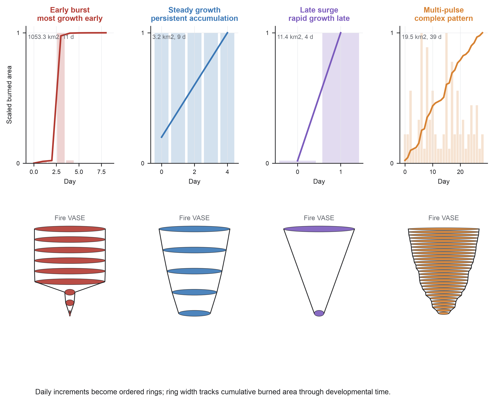
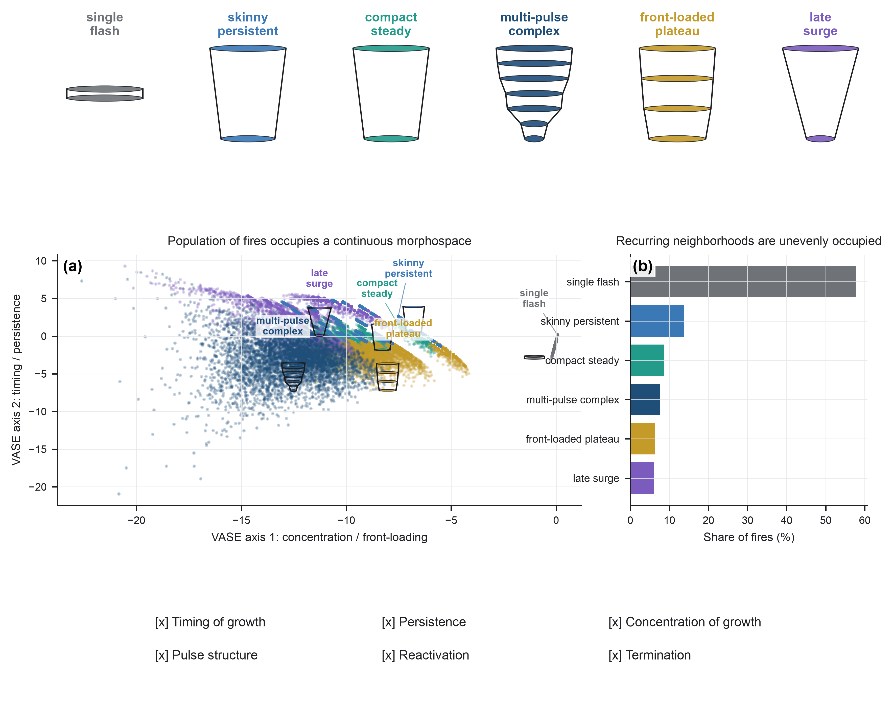
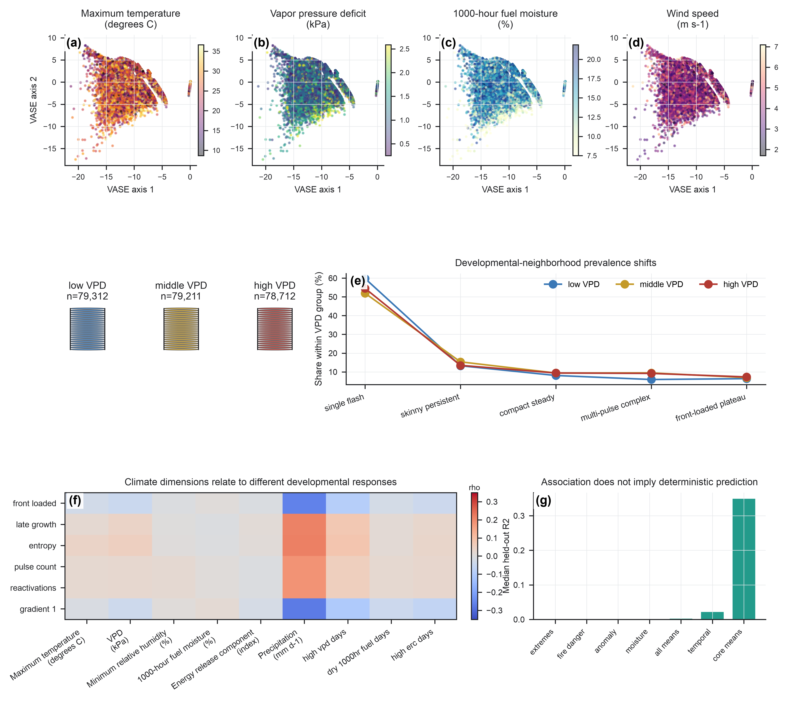
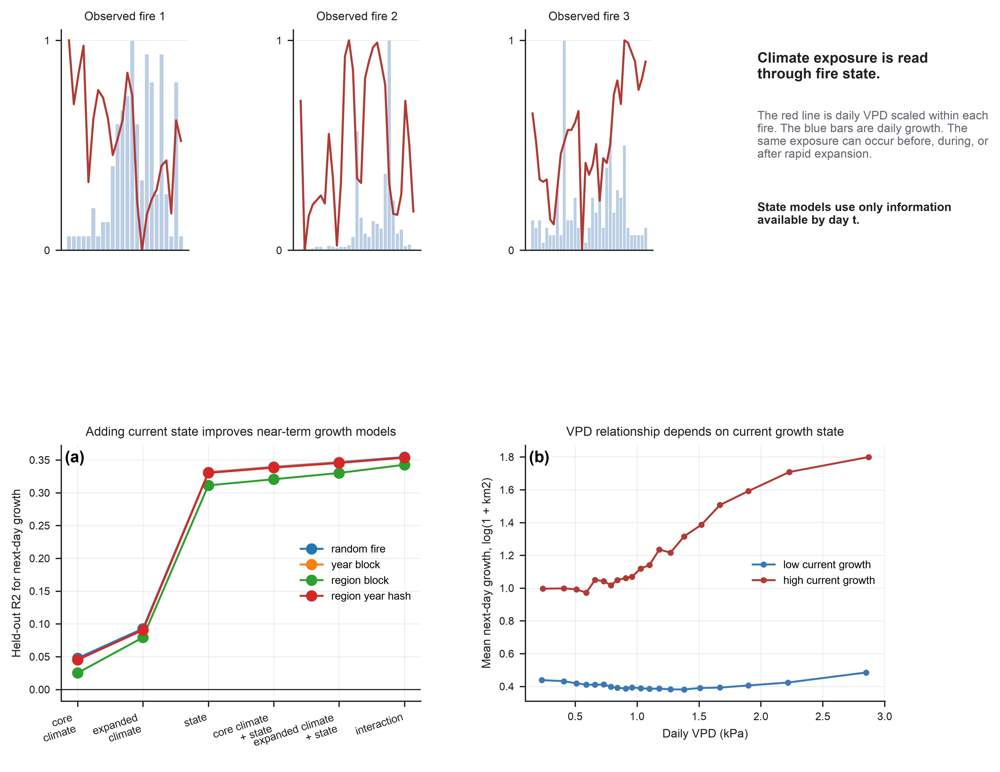
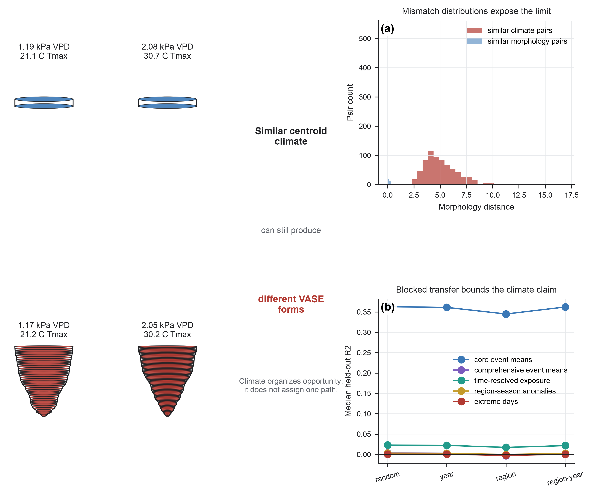
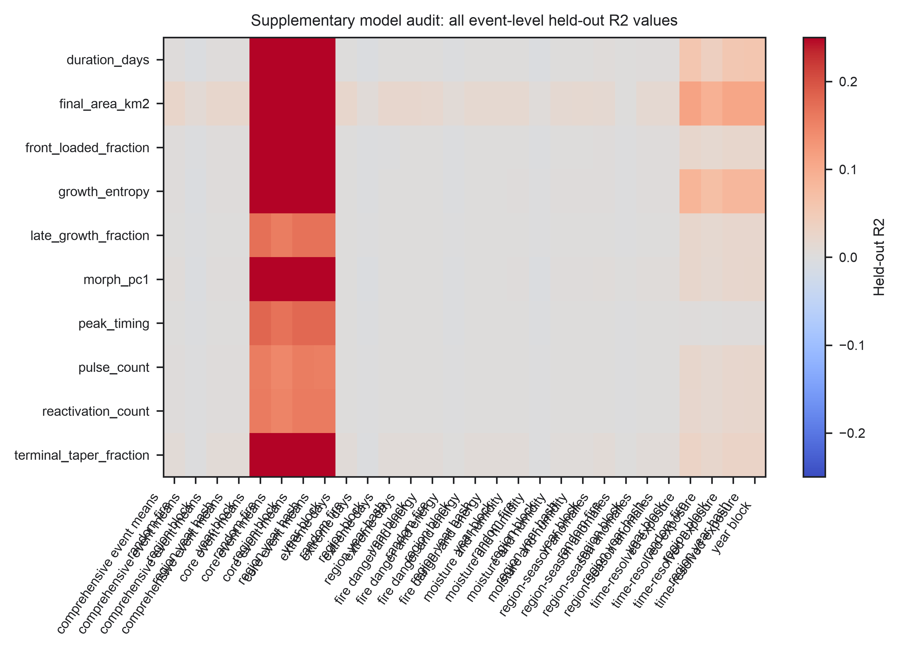
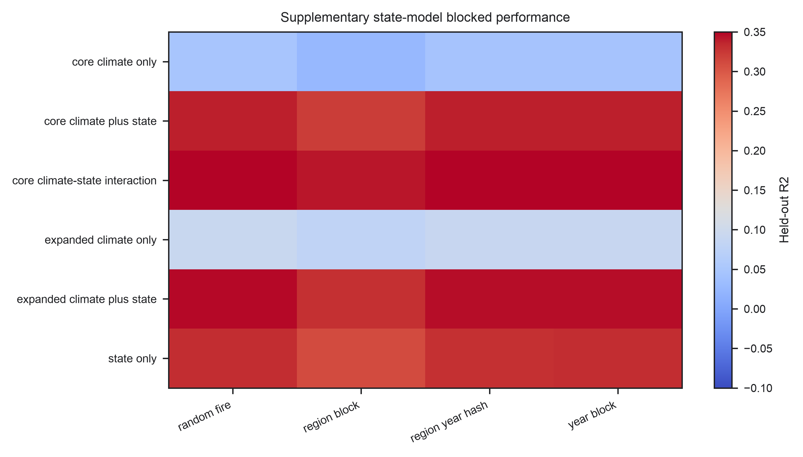
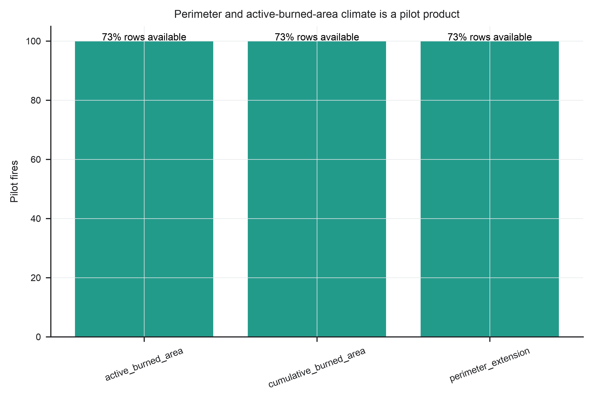

# Reproduce the Figures

The manuscript figures are generated by numbered scripts in
[`manuscript_figures/`](https://github.com/CU-ESIIL/fire_vase/tree/main/manuscript_figures).
Each script reads from the Fire VASE data lake and writes its outputs back into
that folder.

## Current Manuscript Figures

These are the rendered figures for the current climate-revision manuscript.
The source publication files are tracked under `figures/climate_revision_main/`
and `figures/climate_revision_supplement/`; the copies below live under
`docs/assets/figures/` so the website can display them.

<div class="figure-gallery" markdown>

<figure markdown>

<figcaption markdown>
**Figure 1. Fire VASE preserves developmental differences hidden by final
outcomes.** Four observed FIRED events show why final burned area and duration
are insufficient descriptions of wildfire development.
</figcaption>
</figure>

<figure markdown>

<figcaption markdown>
**Figure 2. Wildfire histories vary along recurring developmental gradients.**
Observed fires occupy a continuous Fire VASE morphospace rather than isolated
types.
</figcaption>
</figure>

<figure markdown>

<figcaption markdown>
**Figure 3. Climate shifts the probability of developmental forms.** Climate
variables are projected onto the geometry-first Fire VASE morphospace after the
axes are estimated from fire histories alone.
</figcaption>
</figure>

<figure markdown>

<figcaption markdown>
**Figure 4. Developmental state changes how climate is expressed through
growth.** Leakage-safe next-day models ask how weather exposure depends on the
current developmental state of a fire.
</figcaption>
</figure>

<figure markdown>

<figcaption markdown>
**Figure 5. Climate organizes opportunity without uniquely determining
outcome.** Matched examples and blocked validation define the boundary of the
current centroid-climate interpretation.
</figcaption>
</figure>

</div>

## Supplementary Figures

<div class="figure-gallery figure-gallery--compact" markdown>

<figure markdown>

<figcaption markdown>
**Supplementary Figure 1.** Event-level model summaries.
</figcaption>
</figure>

<figure markdown>

<figcaption markdown>
**Supplementary Figure 2.** State-dependent model summaries.
</figcaption>
</figure>

<figure markdown>

<figcaption markdown>
**Supplementary Figure 3.** Perimeter and active-area climate-exposure pilot.
</figcaption>
</figure>

</div>

## Inputs

Use either a restored repository-style data root or the data-lake package:

```text
data_lake/fire-vase-data-lake-v0.1
```

The figure scripts expect the lake to contain:

- `scratch/fire_vase_run_full/tables/`
- `scratch/fire_vase_developmental_morphology/`
- `repository/figures/main/derived_stats/`
- `repository/analysis/claim_audit_stats/`

## Run All Figures

```bash
uv run python manuscript_figures/00_run_all.py \
  --data-lake data_lake/fire-vase-data-lake-v0.1
```

Outputs are written as PDF, PNG, and SVG files in `manuscript_figures/`.

## Run One Figure

```bash
uv run python manuscript_figures/03_figure_3.py \
  --data-lake data_lake/fire-vase-data-lake-v0.1
```

## Figure Entry Points

- [00_run_all.py](https://github.com/CU-ESIIL/fire_vase/blob/main/manuscript_figures/00_run_all.py)
- [01_figure_1.py](https://github.com/CU-ESIIL/fire_vase/blob/main/manuscript_figures/01_figure_1.py)
- [02_figure_2.py](https://github.com/CU-ESIIL/fire_vase/blob/main/manuscript_figures/02_figure_2.py)
- [03_figure_3.py](https://github.com/CU-ESIIL/fire_vase/blob/main/manuscript_figures/03_figure_3.py)
- [04_figure_4.py](https://github.com/CU-ESIIL/fire_vase/blob/main/manuscript_figures/04_figure_4.py)
- [05_figure_5.py](https://github.com/CU-ESIIL/fire_vase/blob/main/manuscript_figures/05_figure_5.py)
- [06_supplementary_figure_1.py](https://github.com/CU-ESIIL/fire_vase/blob/main/manuscript_figures/06_supplementary_figure_1.py)

Shared plotting code lives in
[`scripts/figures/`](https://github.com/CU-ESIIL/fire_vase/tree/main/scripts/figures).

## Recompute Validation Tables

By default, the scripts seed cached derived statistics from the data lake. To
recompute those validation tables from the lakehouse inputs:

```bash
uv run python manuscript_figures/00_run_all.py \
  --data-lake data_lake/fire-vase-data-lake-v0.1 \
  --force-validation
```

## Check Reproducibility

Compare generated figures and derived statistics against the checked-in
reference artifacts:

```bash
uv run python scripts/check_reproducibility.py --skip-data-lake
```

Save a JSON report:

```bash
uv run python scripts/check_reproducibility.py \
  --skip-data-lake \
  --json-output analysis/reproducibility_check_latest.json
```

The checker reports byte-level file hashes and pixel-level PNG comparisons.
Pixel identity is the stricter visual check for the manuscript figures.
