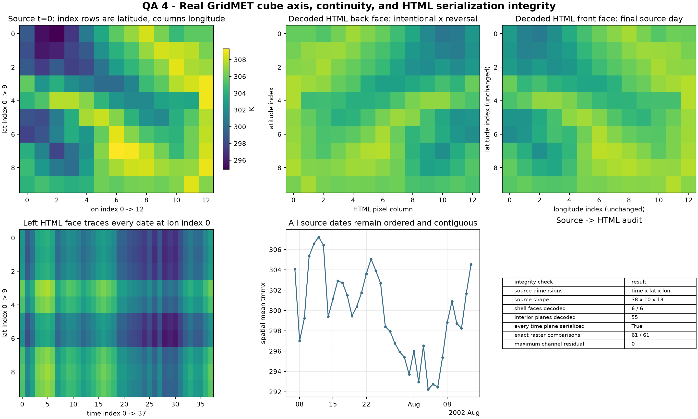

# Data Cube And HTML Axis Integrity

The HTML cube is a rendered view of an xarray/NetCDF source cube. This module
checks both layers of that contract: the source coordinates must be complete
and ordered, and the raster planes placed into the HTML must correspond to the
declared source indices.

```python
from cubedynamics.validation import ValidationPaths
from cubedynamics.validation.cube import run_cube_validation

paths = ValidationPaths.discover()
result = run_cube_validation(paths, fire_id=20657, variable="tmmx")
result.metrics
```



## What Is Checked?

The real sample has 38 daily steps, 10 latitude rows, and 13 longitude columns:
4,940 finite cells with no missing values. The audit requires:

- dimensions in canonical `(time, lat, lon)` order;
- unique, monotonic latitude and longitude coordinates;
- unique, contiguous daily timestamps with no duplicated or missing day;
- all six shell faces and all 55 requested interior planes to be present;
- all 38 time planes to be serialized exactly once between the two end faces
  and 36 interior time planes;
- every decoded HTML RGBA pixel to equal the independently indexed source
  slice under the declared color mapping; and
- eight time/latitude/longitude corner landmarks to land on the expected HTML
  row and column.

All 61 raster comparisons are exact, with maximum RGBA channel residual zero.
The complete source-value hash is embedded in the HTML and recorded in
`cube_source_manifest.json`; per-date hashes are recorded in
`cube_time_slice_checksums.csv`.

## Why Is One Face Reversed?

The back face intentionally reverses longitude before encoding because CSS
rotates that plane by 180 degrees. That is a view transform, not a source-axis
flip. The audit applies that one declared reversal before comparison and
requires all other face and interior-plane orientations to match their source
indices directly.

## Inspect The Audited HTML Cube

This audit view uses `thin_time_factor=1` and includes every interior time
slice. Drag to rotate and use the displayed endpoint labels to compare the
spatial and temporal directions with the static landmark plot above.

<div class="validation-embed validation-embed--cube">
  <iframe
    src="../../assets/validation/cube.html"
    title="Validated real GridMET data cube"
    loading="lazy"
  ></iframe>
</div>

The NetCDF/xarray cube remains the data authority. The HTML is deliberately
auditable, but it is not presented as a replacement data format.

