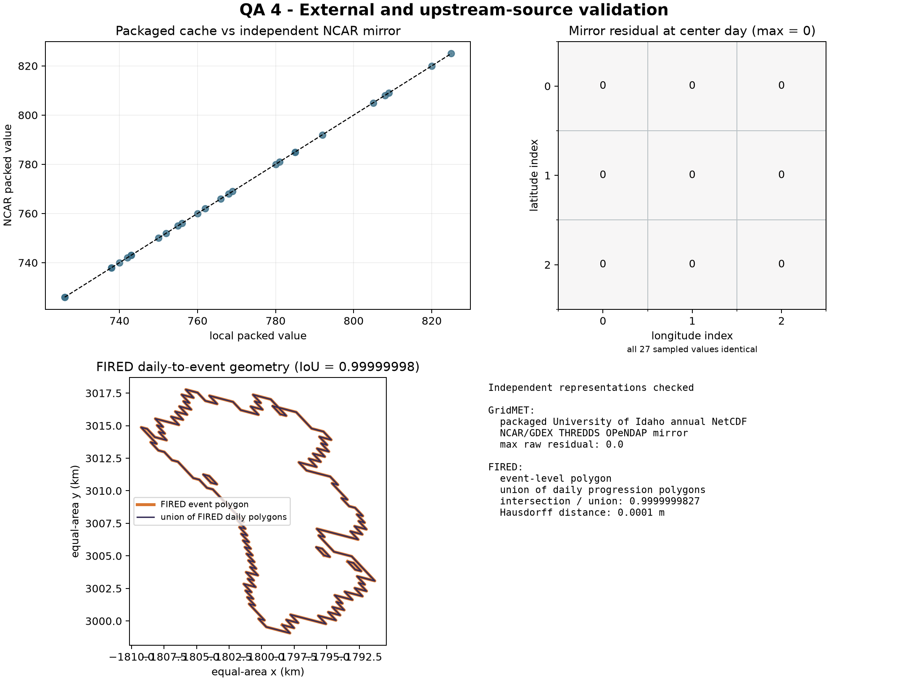

# External And Upstream-Source Checks

The external module compares independent representations at two boundaries.

## GridMET Mirror

The packaged annual NetCDF came from the University of Idaho GridMET service.
The module requests a tiny raw-value block for the same variable, year, date,
and grid indices from the independent NCAR/GDEX THREDDS mirror. It compares the
packed integers before scale/offset decoding, which avoids false agreement from
rounding after conversion.

```python
from cubedynamics.validation import ValidationPaths
from cubedynamics.validation.external import run_external_validation

paths = ValidationPaths.discover()
result = run_external_validation(
    paths,
    fire_id=20657,
    variable="tmmx",
    external_network=True,
)
```

The published run compared 27 raw cells and found zero residual for every one.
Network access is optional so offline validation stays reproducible; a skipped
mirror query is recorded explicitly in `result.json`.

## FIRED Daily And Event Products

The event-level FIRED polygon is compared with the union of its 29 daily
progression polygons in EPSG:5070. The sampled event has intersection-over-union
`0.9999999827` and a Hausdorff distance of `0.000125 m`, showing that the two
upstream layers identify the same footprint to numerical projection tolerance.



## Sources And Reuse

- GridMET is a roughly 4 km, daily surface meteorology product described by
  [Abatzoglou (2013)](https://doi.org/10.1002/joc.3413) and distributed through
  the [University of Idaho GridMET catalog](https://verso.uidaho.edu/esploro/outputs/dataset/Data-REACCHPNA-Modeling-CMIP5-gridMET-Catalog/996765645101851).
- The independent comparison uses the
  [NCAR/GDEX GridMET THREDDS collection](https://tds.gdex.ucar.edu/thredds/catalog/files/d761426/catalog.html).
- FIRED source, citation, and cache guidance are documented on the
  [FIRED dataset page](../datasets/fired.md).

The validation suite stores only small derived QA samples and plots in the
repository. Users of the underlying source data remain responsible for the
upstream citation and reuse terms.
