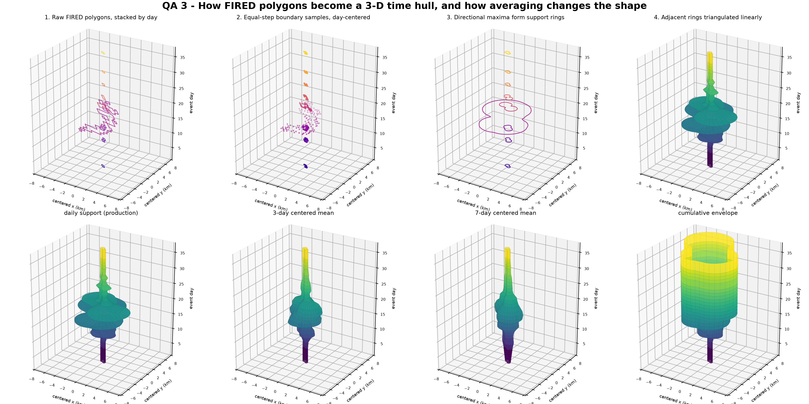

# Three-Dimensional Hull Construction And Averaging

This module shows the actual three-dimensional construction rather than only
reporting two-dimensional boundary metrics. The upper row of the QA figure
follows one real FIRED event through four explicit stages:

1. stack the daily polygons at their `event_day` values;
2. take equal-distance samples around each boundary and center that day;
3. retain the maximum projection in each of 96 directions, producing one
   directional support ring per observed day; and
4. triangulate corresponding directions between adjacent observed days.

```python
from cubedynamics.validation import ValidationPaths
from cubedynamics.validation.hull3d import run_hull3d_validation

paths = ValidationPaths.discover()
result = run_hull3d_validation(
    paths,
    fire_id=20657,
    n_theta=96,
    averaging_windows=(1, 3, 7),
)
result.metrics
```



## Which Averaging Decision Is Production?

The production method is the lower-left surface labeled **daily support**. It
does not take a moving average across FIRED days. Boundary concavities are
removed within each day by the directional maximum, and corresponding support
radii are connected linearly from one observed day to the next.

The other surfaces deliberately answer "what if?":

- a 3-day centered mean dampens brief radial expansion;
- a 7-day centered mean imposes stronger temporal smoothness; and
- a cumulative envelope never allows a direction to contract after it has
  expanded.

For this event, independently reconstructed production radii agree with the
production mesh to `1.8e-15 km`. Alternative decisions change the mean radius
by as much as 2.90 km and an individual direction by as much as 6.99 km. Those
are substantive modeling decisions, so the alternatives are labeled and never
silently substituted.

## Rotate The Alternatives

Use the dropdown in the interactive plot to switch between the four surfaces,
then drag to inspect the shape from any angle.

<div class="validation-embed">
  <iframe
    src="../../assets/validation/hull3d.html"
    title="Interactive three-dimensional hull averaging alternatives"
    loading="lazy"
  ></iframe>
</div>

The module also writes `hull_averaging_metrics.csv`, including volume,
directional roughness, and radial displacement from the production decision.

