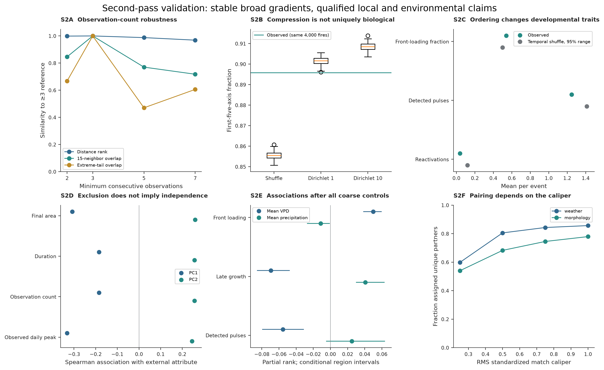
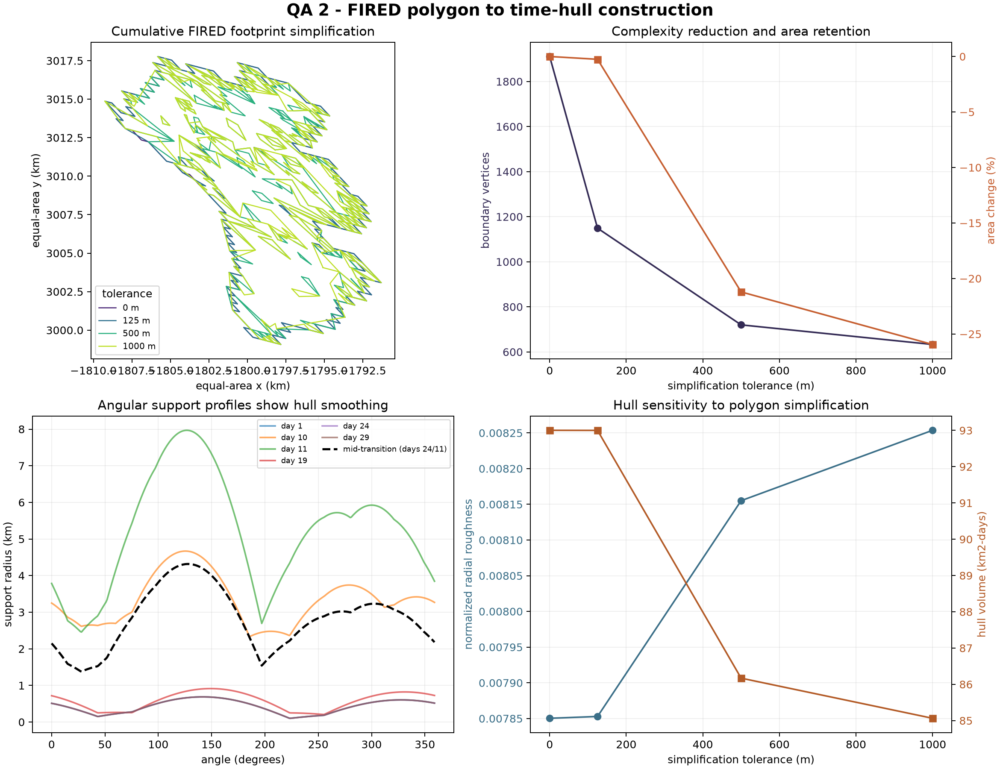
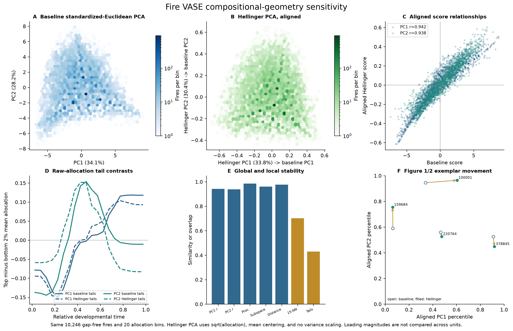
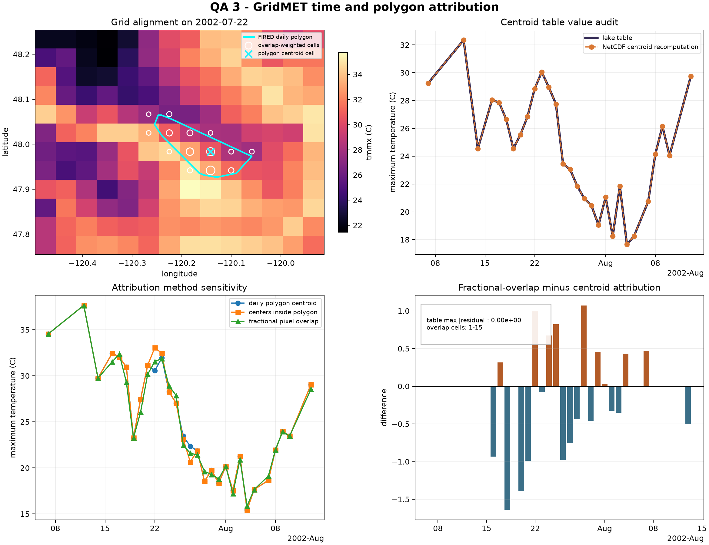
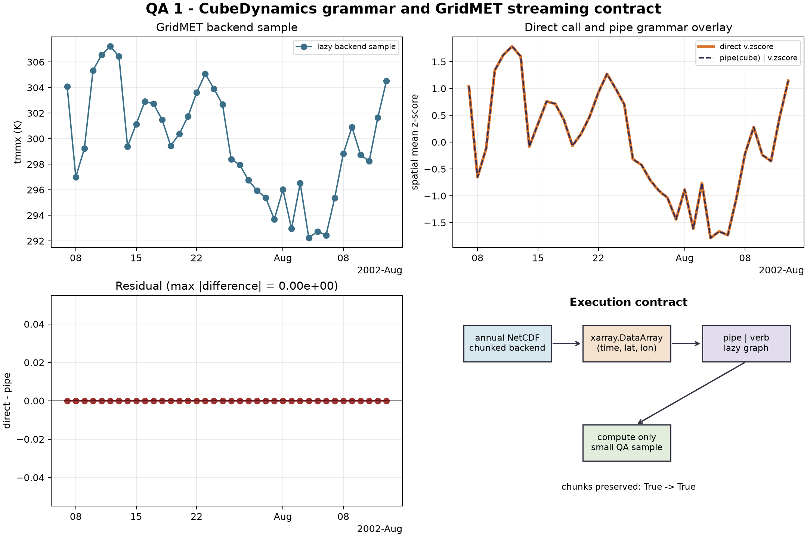
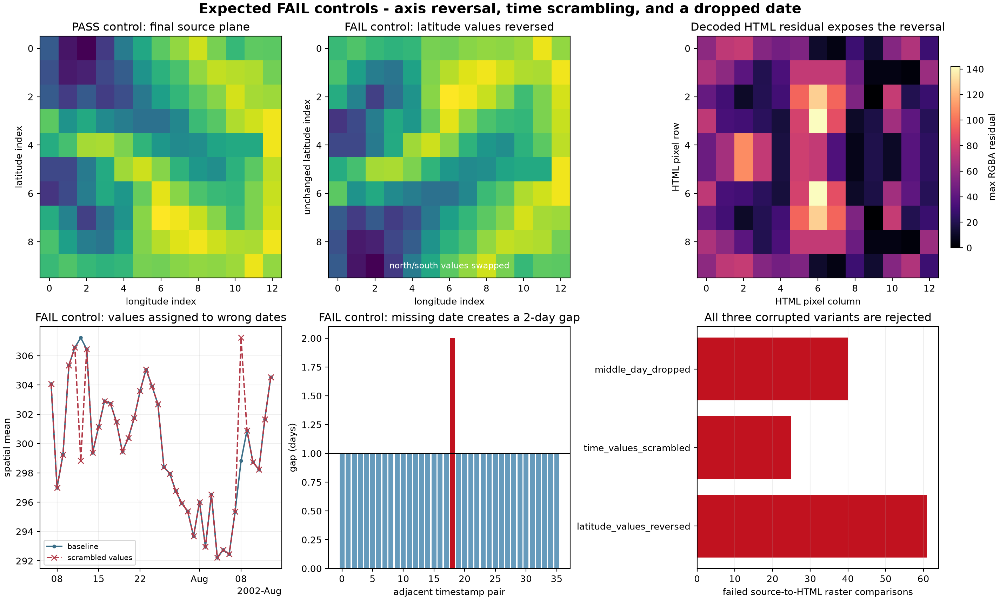
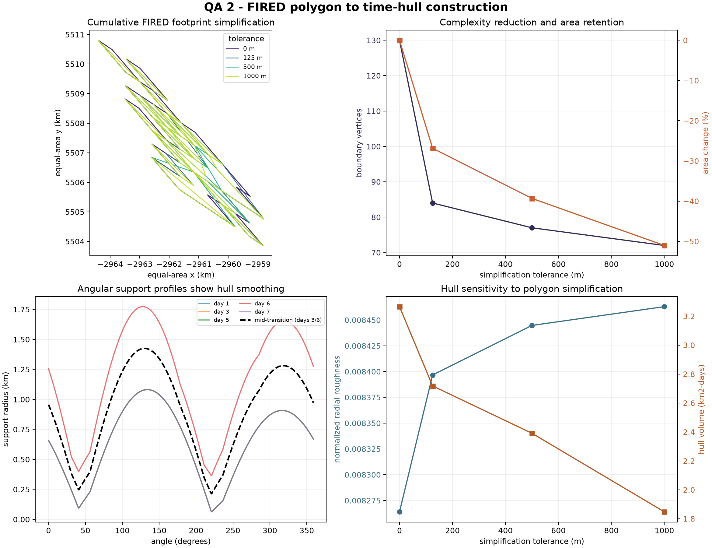

# How we tried to break Fire VASE

<p class="fire-page-deck">Validation is organized around threats to the scientific argument: incomplete observation, constrained geometry, uninformative order, incorrect attribution, implementation errors, and tests that pass too easily.</p>

<div class="fire-validation-hero" markdown>
<strong>6 / 6 PASS</strong>
<span>real-data validation modules in the published suite manifest</span>
<small>Generated 25 August 2026 for FIRED event 20657; full repository suite: 152 passed, 2 intentionally skipped.</small>
</div>

The six-module result checks an inspectable real-data sample and documented
contracts. Population-scale statistical validation, null models, sensitivity
analyses, and full-table provenance provide separate layers of evidence. A
passing module is not treated as proof of ecological validity.

<section class="fire-figure fire-figure--wide" markdown>



<div class="fire-figure__caption" markdown>
<strong>The central challenge figure.</strong> Read S2A–F as six attempts to
weaken or narrow the argument, not as six confirmations of one claim. Some
results hold strongly; others impose explicit limits on transfer, compression,
weather attribution, or matching coverage. [Technical caption](../reproduce-figures.md#supplementary-figure-2-second-pass-validation)
</div>
</section>

<details class="fire-read-figure" open>
<summary>How to read the validation figure</summary>
<div markdown>

- **S2A — observation depth:** broad distance ranks persist, while local
  neighborhoods and five-axis coverage weaken.
- **S2B — allocation nulls:** other positive, mass-conserving histories also
  compress; low dimensionality alone is not uniquely biological.
- **S2C — temporal order:** shuffling the same increments changes
  order-sensitive traits while leaving entropy invariant.
- **S2D–E — excluded endpoints and weather:** projection and adjustment expose
  association without putting endpoints or weather into the primary axes.
- **S2F — matching:** stricter calipers trade partner coverage for closer
  matches.
- **Look here:** The scientific outcome is the pattern of persistence *and*
  qualification across panels—not the presence of a “PASS” label.

</div>
</details>

## Does the result depend on observation depth?

**Threat.** Short histories may impose structure that would disappear when
more daily observations are required.

**Challenge.** Refit the shape space at stricter consecutive-observation
thresholds and evaluate each fit on the same 1,000 primary-event anchors.

<div class="fire-counterfactual" markdown>
<div><span>What would worry us</span><p>Distance ranks, neighborhood overlap,
and axis coverage collapse together as longer histories are required.</p></div>
<div><span>What we see</span><p>Broad ranks remain stable, but local
neighborhoods and compact five-axis coverage weaken.</p></div>
</div>

**Result.** At ≥7 observations, 1,171 fires remain. Pairwise-distance ranks
correlate **0.969** with the primary fit, but 15-neighbor overlap is **71.8%**
and five-axis coverage falls to **74.2%**. Broad gradients persist better than
local neighborhoods, dimensionality, and extreme examples.

<div class="fire-hold"><strong>Holds:</strong> broad developmental gradients <span>Qualified:</span> local geometry and long-history transfer</div>

[Inspect observation-depth evidence](../findings/developmental-pathways.md#how-well-does-it-hold-up)

## Could the geometry be an artifact?

**Threat.** Normalized positive curves, PCA choices, polygon simplification, or
hull construction might manufacture an apparently restricted space.

**Challenge.** Compare standardized-Euclidean and Hellinger geometry; use
mass-conserving Dirichlet nulls; vary temporal support and resolution; audit
FIRED simplification; expose daily, 3-day, 7-day, and cumulative 3-D hull
alternatives.

<section class="fire-figure fire-figure--validation" markdown>



<div class="fire-figure__caption" markdown>
<strong>Look here.</strong> Source and simplified geometry agree within the
declared production tolerance for this inspected event. This software check is
separate from the population-level compositional sensitivity below.
</div>
</section>

<details class="fire-read-figure">
<summary>How to read the geometry checks</summary>
<div markdown>

The production validation recomputes polygon simplification, support profiles,
and hull metrics. Supplementary Figure 4 then changes the *analysis geometry*
used to compare normalized histories. Agreement in one does not make the other
automatic.

</div>
</details>



<div class="fire-counterfactual" markdown>
<div><span>What would worry us</span><p>The early-versus-late axis disappears,
or small methodological changes produce unrelated spaces.</p></div>
<div><span>What we see</span><p>The broad configuration persists, while exact
neighbors, secondary contrasts, and extreme exemplars move.</p></div>
</div>

**Result.** The leading early-versus-late gradient and broad configuration are
stable. Exact neighbors, secondary contrasts, and extreme exemplars change.
Positive null histories also compress, so compression alone is not uniquely
biological. The production hull is reproduced to numerical precision, while
alternative temporal averaging visibly changes it.

<div class="fire-hold"><strong>Holds:</strong> broad configuration <span>Rejected:</span> a universal restricted-wedge claim</div>

[Geometry and hull audit](geometry.md) · [3-D decision audit](hull3d.md) ·
[Compositional sensitivity](../reproduce-figures.md#supplementary-figure-4-compositional-geometry-sensitivity)

## Is temporal ordering actually informative?

**Threat.** Fire VASE might encode only the total and distribution of growth
increments, not their sequence.

**Challenge.** Shuffle the complete increment multiset within each of 4,000
fires while preserving its count and reconstructed total.

<div class="fire-counterfactual" markdown>
<div><span>What would worry us</span><p>Order-sensitive traits remain unchanged,
or an order-insensitive invariant changes.</p></div>
<div><span>What we see</span><p>Front-loading, pulses, and reactivation change;
entropy remains unchanged as required.</p></div>
</div>

**Result.** Observed histories are more front-loaded (**0.541 vs 0.500**), less
pulsed (**1.249 vs 1.413**), and less frequently reactivated (**0.038 vs
0.120**) than shuffled histories. Entropy stays unchanged, as required.

<div class="fire-hold"><strong>Holds:</strong> observed ordering carries information <span>Not shown:</span> a causal mechanism</div>

[See the temporal-order test](../findings/temporal-ordering.md)

## Could climate attribution be wrong?

**Threat.** A date, cell, centroid, or retrospective geometry error could
create spurious weather associations.

**Challenge.** Recompute event dates and centroid values from FIRED and
gridMET; compare centroid with fractional polygon–pixel overlap; sample
next-day models at the day’s newly burned-area centroid; independently compare
packed gridMET values with the NCAR mirror.

<section class="fire-figure fire-figure--validation" markdown>



<div class="fire-figure__caption" markdown>
<strong>Look here.</strong> The audit checks dates and values against declared
sources, then makes the centroid-versus-overlap sensitivity visible rather
than treating one spatial summary as universally correct.
</div>
</section>

<div class="fire-counterfactual" markdown>
<div><span>What would worry us</span><p>Missing source dates, disagreement with
the independent mirror, or use of future/static geometry in next-day models.</p></div>
<div><span>What we see</span><p>Dates and packed values agree; day-specific
geometry removes one look-ahead route. Sub-grid exposure uncertainty remains.</p></div>
</div>

**Result.** Published tables reproduce exactly for the inspected event, source
dates are present in gridMET, and external packed values agree. Day-specific
geometry removes one spatial look-ahead pathway. Fractional overlap can differ
from centroid attribution and remains an explicit sensitivity—not a hidden
replacement.

<div class="fire-hold"><strong>Holds:</strong> documented attribution contract <span>Remaining:</span> sub-grid and active-edge exposure uncertainty</div>

[Climate attribution](climate.md) · [External sources](external.md)

## Does the implementation reproduce the intended transformations?

**Threat.** Pipe execution, lazy loading, cube serialization, geometry, or
source joins could silently diverge from the intended methods.

**Challenge.** Six isolated modules recompute the most failure-prone handoffs
on the same real FIRED event. Each writes machine-readable metrics and a plot;
the suite writes a manifest and collated report.

<section class="fire-figure fire-figure--validation" markdown>



<div class="fire-figure__caption" markdown>
<strong>Look here.</strong> Direct and pipe-style transformations agree, while
lazy access remains chunked. This checks a failure-prone software handoff; it
does not validate the ecological interpretation by itself.
</div>
</section>

| Module | Published status | What is recomputed |
|---|---:|---|
| [Pipe and stream](pipeline.md) | PASS | Direct and pipe-style operations; lazy chunks |
| [Cube and HTML](cube.md) | PASS | Coordinates, every time plane, HTML faces/interiors, pixels, hashes |
| [Geometry and hull](geometry.md) | PASS | Simplified polygons, support profiles, hull metrics |
| [3-D hull decisions](hull3d.md) | PASS | Production mesh and temporal-averaging alternatives |
| [Climate attribution](climate.md) | PASS | Dates, centroid values, polygon–pixel overlaps |
| [External sources](external.md) | PASS | NCAR gridMET values and FIRED event/daily geometry |

[Download the collated QA report](../assets/validation/fire_vase_validation_report.pdf){ .md-button .fire-button }

## Do the tests detect deliberately incorrect cases?

**Threat.** A validator that always passes is not evidence.

**Challenge.** Reverse latitude, scramble time, drop a day, and run the
geometry threshold against a real FIRED event known to exceed it.

<div class="fire-validation-pair" markdown>
<figure>

<figcaption>Cube controls: the clean case passes; reversed latitude, scrambled time, and a dropped day fail their intended checks.</figcaption>
</figure>
<figure>

<figcaption>Geometry control: a known real-data case exceeds the declared 125-m simplification tolerance.</figcaption>
</figure>
</div>

<div class="fire-counterfactual" markdown>
<div><span>What would worry us</span><p>Corrupted inputs pass, or clean and bad
cases are indistinguishable.</p></div>
<div><span>What we see</span><p>The clean cube passes and every deliberate
corruption fails the intended validator.</p></div>
</div>

**Result.** The clean cube passes; all three corrupted cubes fail the intended
checks; the real geometry case fails the declared 125-m area-change tolerance.
These are expected failures and are kept separate from the six production
results.

<div class="fire-hold"><strong>Holds:</strong> validators distinguish known-good and deliberately bad cases</div>

[Inspect expected-failure controls](contrast.md)

## Reproduce the suite

```bash
uv run python scripts/run_validation.py --external --publish-docs
PYTHONPATH=src:scripts:. .venv/bin/pytest -q
```

The first command requires the materialized data lake and network access for
the independent mirror check. The validation notebook exposes one executable
section per module.

[Open the validation notebook](https://github.com/CU-ESIIL/fire_vase/blob/main/notebooks/validate_fire_vase_pipeline.ipynb){ .md-button .md-button--primary .fire-button }
[All reproducibility routes](../reproduce/index.md){ .md-button .fire-button }
[AI use and scientific accountability](../ai-accountability.md){ .md-button .fire-button }

??? info "Scope and provenance"

    The 6/6 status comes from `output/validation/validation_manifest.json`.
    Population-level claims come from the current v2 manuscript and
    `analysis/scientific_validation/`. The [correction record](../reanalysis-v2.md)
    documents superseded analyses and the final full-suite test result.

<nav class="fire-next">
<a href="../findings/mismatched-fires/"><small>Previous</small><strong>What remains unexplained?</strong></a>
<a href="../reproduce/"><small>Next</small><strong>Reproduce Fire VASE →</strong></a>
</nav>
